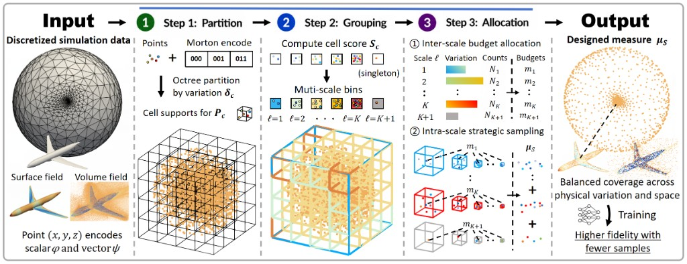
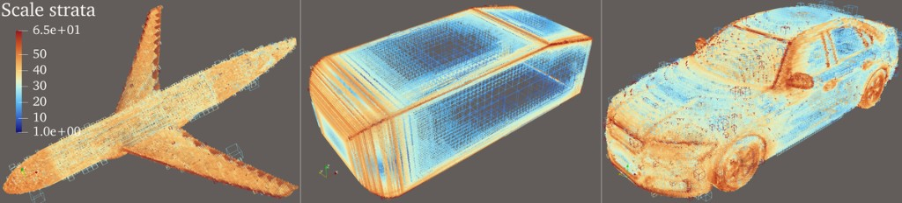
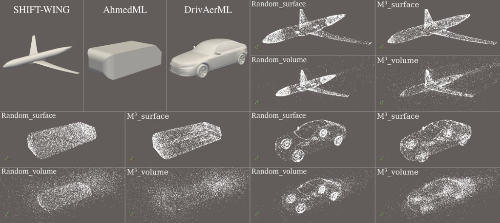
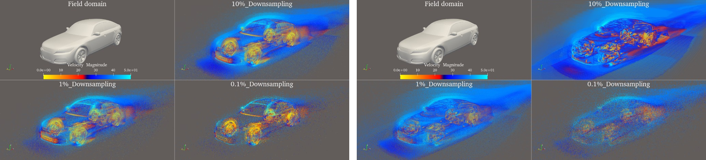
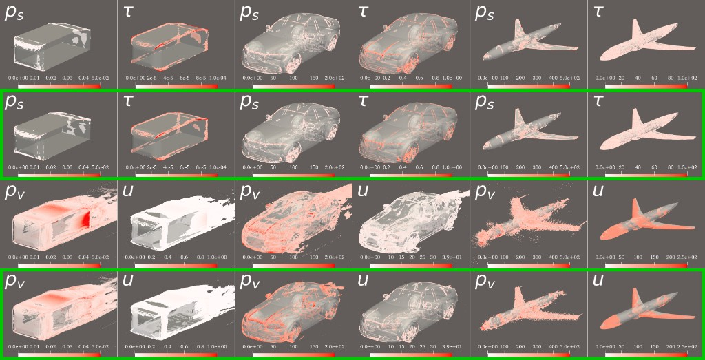
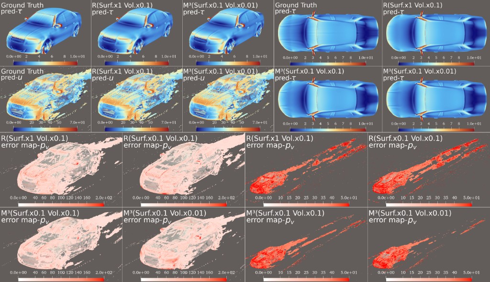

# M³: Multi-scale Measure Modeling

**Paper:** [M³: Reframing Training Measures for Discretized Physical Simulations](https://arxiv.org/abs/2605.08843) (NeurIPS 2026)

M³ refines training data for 3D physical fields from discretized simulations, enabling models to achieve higher accuracy and physical fidelity with less data. Conventional meshes place most points in refined regions, so a fixed training budget often follows the mesh rather than the underlying physical variation. M³ keeps the original solver output and reallocates this budget in three stages: partitioning by physical variation, grouping cells into scales, and allocating the budget across scales. With data reduced from 160M to 1.6M points, models trained with M³ still outperform those trained on higher-resolution data, achieving 3–4× lower physics-weighted relative $L_2$ error and up to 13× lower MSE across most of the domain.

<p align="center">
  
</p>

## Multi-scale cells

M³ partitions surface and volume fields into cells at different scales based on physical variation.

<p align="center">
  
</p>

## Spatial sampling patterns

**Downsampled to 8,192 points.** Random follows the mesh, while M³ covers multiple physical scales: more structured sampling on relatively uniform meshes (AhmedML), multi-scale coverage on highly non-uniform meshes (DrivAerML), and balanced budget allocation under anisotropic refinement patterns (SHIFT-Wing).

<p align="center">
  
</p>

## Field distributions after vanilla and M³ refinement

**DrivAerML volume velocity** at 100%, 10%, 1%, and 0.1% sampling rates. **Left:** Random. **Right:** M³. Random sampling concentrates heavily in the boundary layer, while M³ preserves a wider range of field values, keeping more levels of the underlying physics in the training set.

<p align="center">
  
</p>

## Inference error from M³-trained models

**Full-mesh error.** Models trained with M³ are marked by green outlines. Random spreads high-error regions more widely, while M³ keeps them more localized.

<p align="center">
  
</p>

**Trained with less data.** **Blue:** prediction. **Pink:** error. **Red:** the same error with the color range extended into the far wake. Even with fewer training samples, M³ preserves sharp leading-edge shear streaks close to the ground truth, while Random blurs them. In the volume, M³ also leaves fewer high-error points near the wall and through the wake.

<p align="center">
  
</p>

---

**Refining data for large-scale simulation.**

Training data shapes what a model learns. Simulation meshes are often highly non-uniform, with dense refinement concentrated in selected regions and much coarser resolution elsewhere. When these meshes are used directly for training, a fixed data budget can inherit this uneven distribution, overrepresenting refined regions while underrepresenting others. M³ reshapes the training distribution across physical scales, enabling better coverage with fewer samples. The result is a more efficient path to high-fidelity physical simulation: less data, lower cost, and better use of every training point.

## Quick start

```bash
python examples/toy_example.py
```

```python
from m3 import run_m3

out = run_m3(
    points_xyz=xyz,      # (N, 3)
    phi_scalar=pressure, # (N,)
    psi_vec3=wss,        # (N, 3) or None
    budget=8192,
    file_type="boundary",  # or "volume"
    seed=42,
)
# out.sampled_indices  → indices into the original point array
```

Defaults are in [`hyperparameters.yaml`](hyperparameters.yaml). Surface and volume are separate calls.

## Citation

```bibtex
@inproceedings{mei2026m3,
  title={M$^3$: Reframing Training Measures for Discretized Physical Simulations},
  author={Mei, Yuan and Song, Xingyu and Song, Xiaowen and Takeishi, Naoya},
  booktitle={Advances in Neural Information Processing Systems},
  year={2026}
}
```
